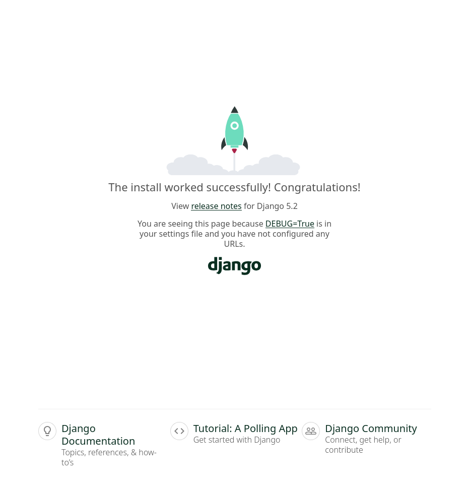

# djangotutorial

## Comandos para git

- `git clone https://github.com/eeparquedasaroeiras/djangotutorial.git`
- `git status`
- `git add .`
- `git commit -m "mesangem doque foi feito"`
- `git push`

## Comandos

1. `pip install django`
2. `python manage.py migrate`
3. `python manage.py createsuperuser`
4. `python manage.py runserver`
5. Abrir no navegador o site http://localhost:3000
6. 
7. Depois acessar http://localhost:3000/admin
8. 

## Documantação

- [Documantação do projeto](doc/README.md)
- https://docs.djangoproject.com/en/5.1/
