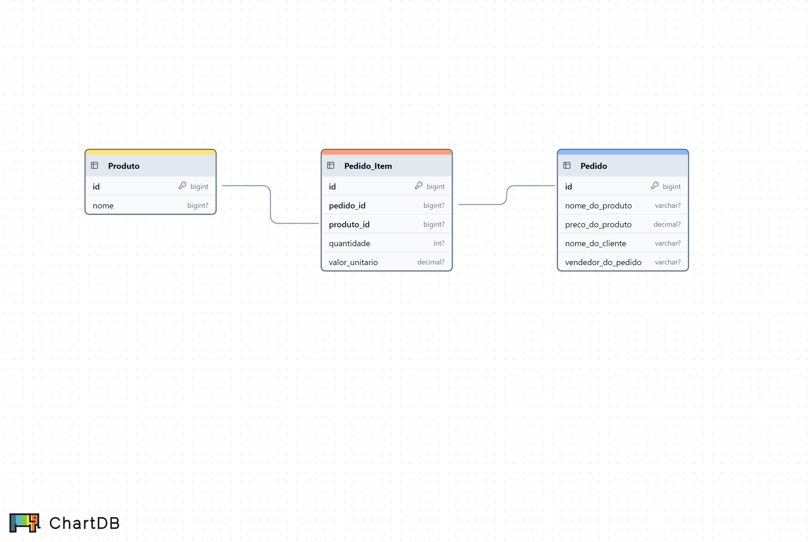

# Aula 2



```mysql
-- MySQL database export

START TRANSACTION;

CREATE TABLE IF NOT EXISTS `Pedido` (
    `id` BIGINT NOT NULL,
    `nome_do_produto` VARCHAR(255),
    `preco_do_produto` DECIMAL,
    `nome_do_cliente` VARCHAR(255),
    `vendedor_do_pedido` VARCHAR(255),
    PRIMARY KEY (`id`)
);


CREATE TABLE IF NOT EXISTS `Pedido_Item` (
    `id` BIGINT NOT NULL,
    `pedido_id` BIGINT UNIQUE,
    `produto_id` BIGINT UNIQUE,
    `quantidade` INT,
    `valor_unitario` DECIMAL,
    PRIMARY KEY (`id`)
);


CREATE TABLE IF NOT EXISTS `Produto` (
    `id` BIGINT NOT NULL,
    `nome` BIGINT,
    PRIMARY KEY (`id`)
);


-- Foreign key constraints

ALTER TABLE `Pedido`
ADD CONSTRAINT `fk_Pedido_id` FOREIGN KEY(`id`) REFERENCES `Pedido_Item`(`pedido_id`)
ON UPDATE CASCADE ON DELETE RESTRICT;

ALTER TABLE `Pedido_Item`
ADD CONSTRAINT `fk_Pedido_Item_produto_id` FOREIGN KEY(`produto_id`) REFERENCES `Produto`(`id`)
ON UPDATE CASCADE ON DELETE RESTRICT;

COMMIT;

```